# MovieLand 🎥

MovieLand is a captivating movie streaming and discovery app that brings the magic of cinema right to your fingertips. With an extensive collection of movies from various genres, MovieLand offers a seamless and immersive movie-watching experience for users of all ages.

## Play Store Link

[View App](https://joharkhan.itch.io/movieland)

## Features

- **Explore**: Dive into a vast library of movies, ranging from timeless classics to the latest blockbusters. Discover captivating storytelling and cinematic excellence.

- **Watch**: Enjoy a seamless streaming experience with high-definition movies. Sit back, relax, and immerse yourself in the magic of the big screen.

- **Personalized Recommendations**: Let MovieLand be your movie guide. Our intelligent recommendation system suggests movies tailored to your taste, helping you discover new favorites.

- **Save and Share**: Create your personalized watchlist by saving movies that catch your interest. Easily access your must-watch films and share your recommendations with friends and family.

- **User-Friendly Interface**: MovieLand features a sleek and intuitive interface, enhancing your movie-watching experience. Navigate effortlessly through genres, search for specific titles, and customize settings.

- **Offline Viewing**: Download your favorite films and enjoy them offline, perfect for long journeys or areas with limited internet connectivity.

## Screenshots

  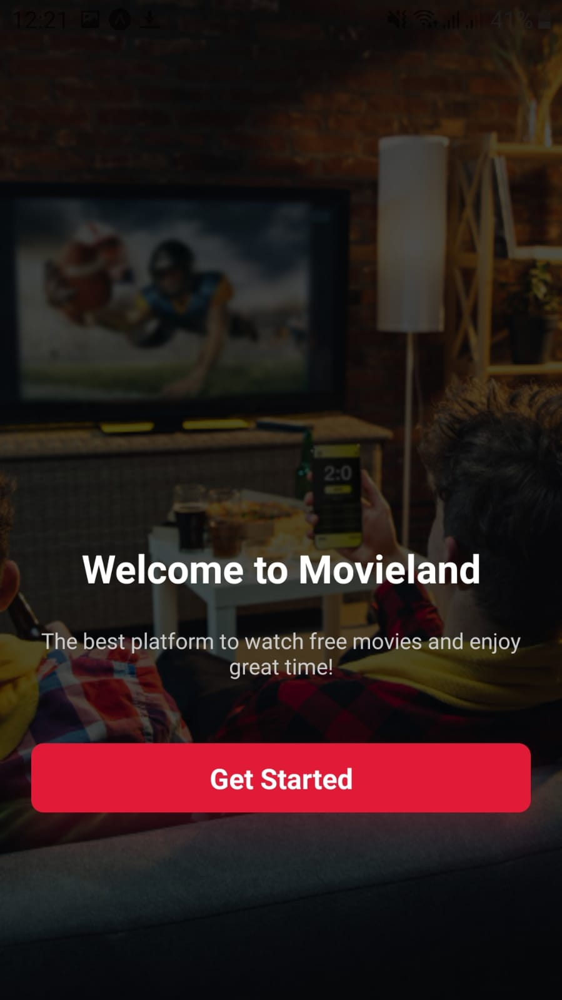
  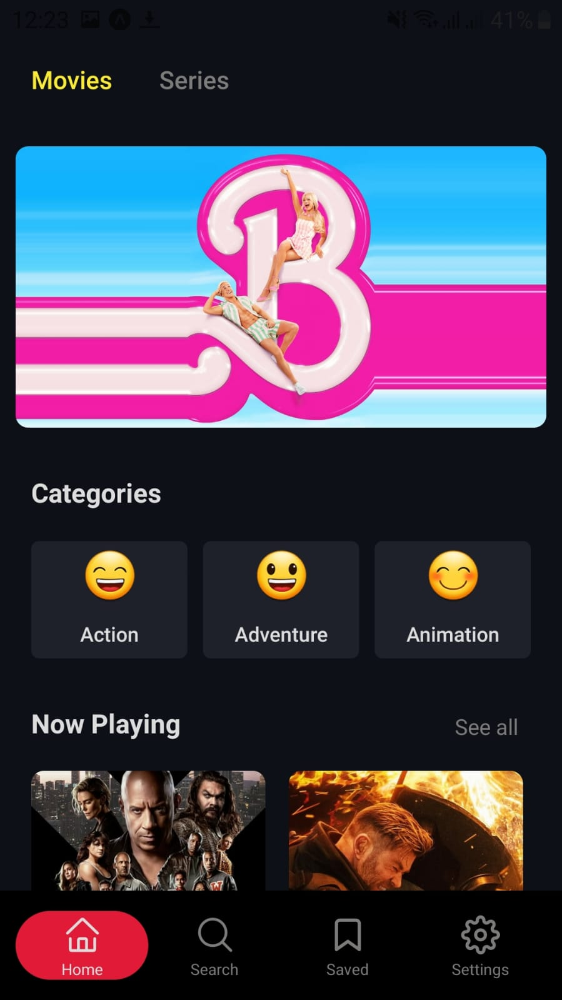
  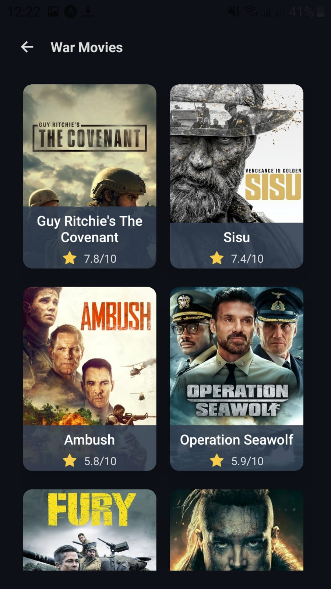
  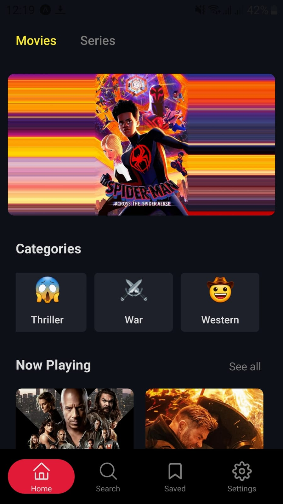
  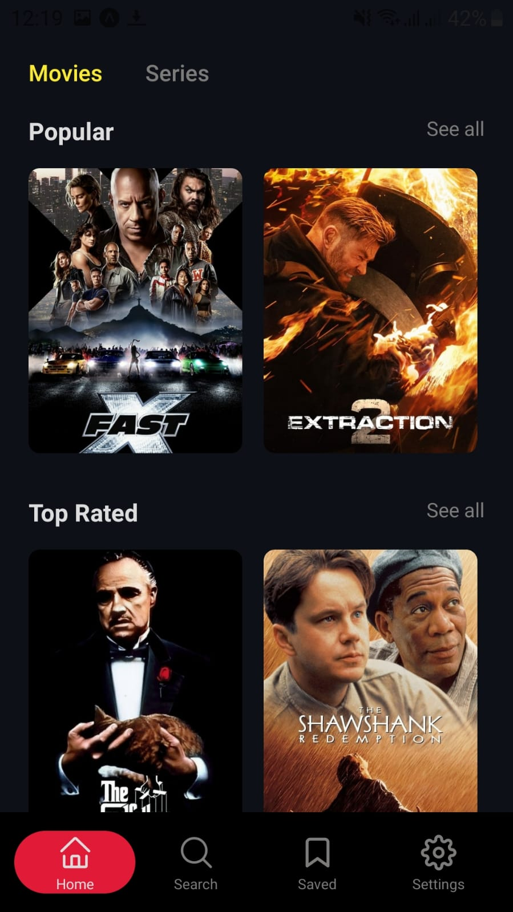
  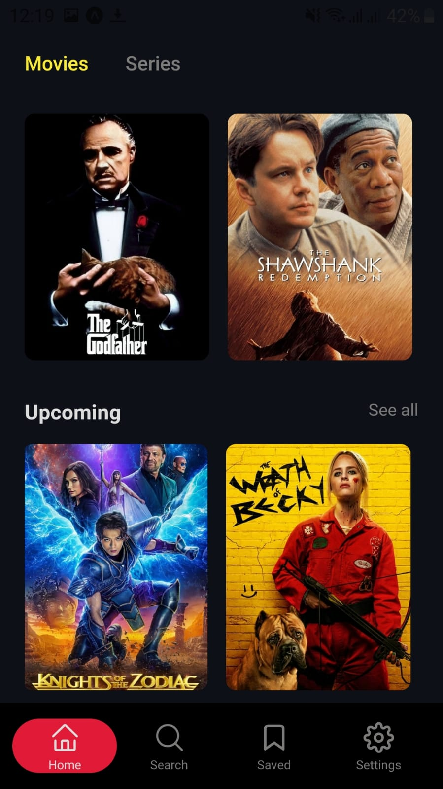
  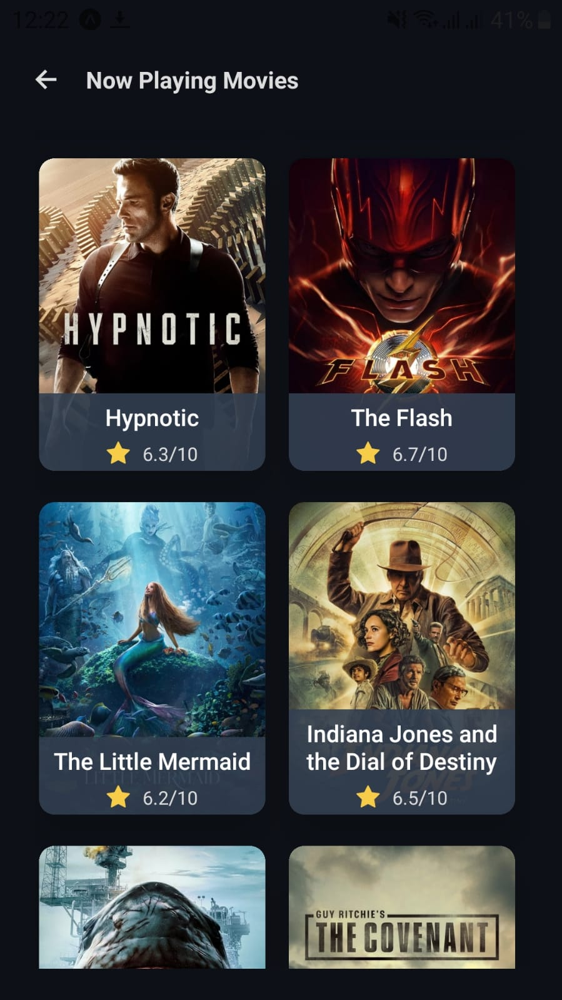
  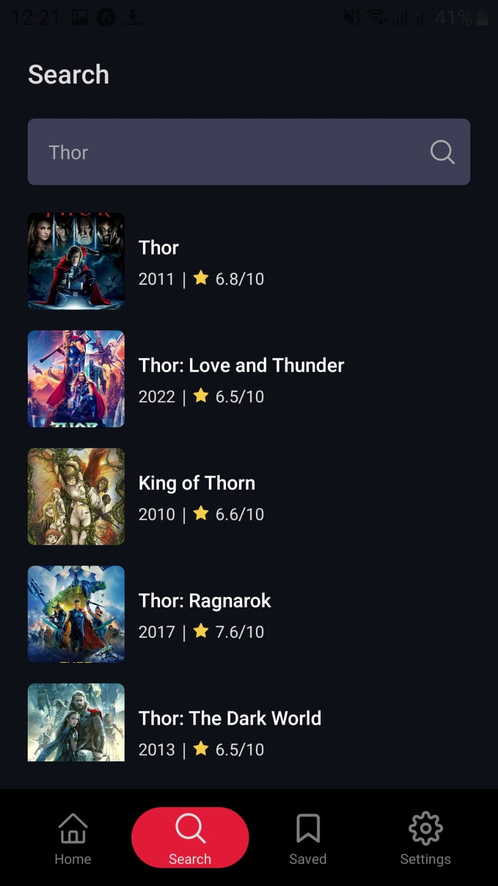
  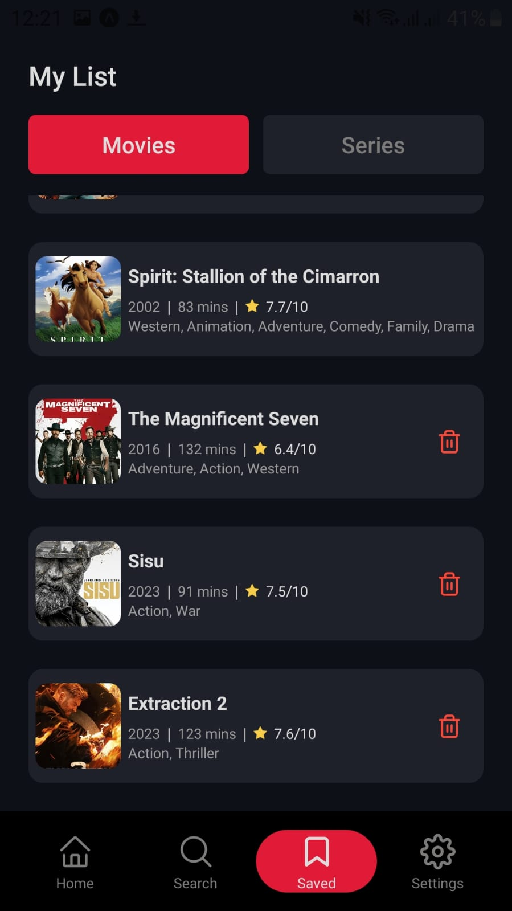
  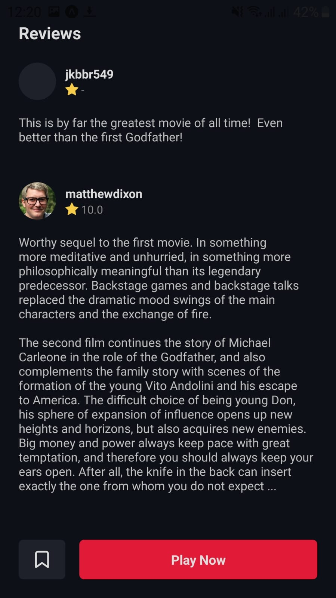
  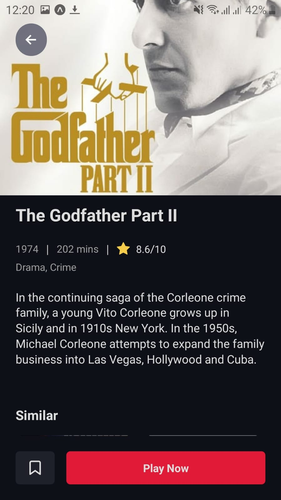
  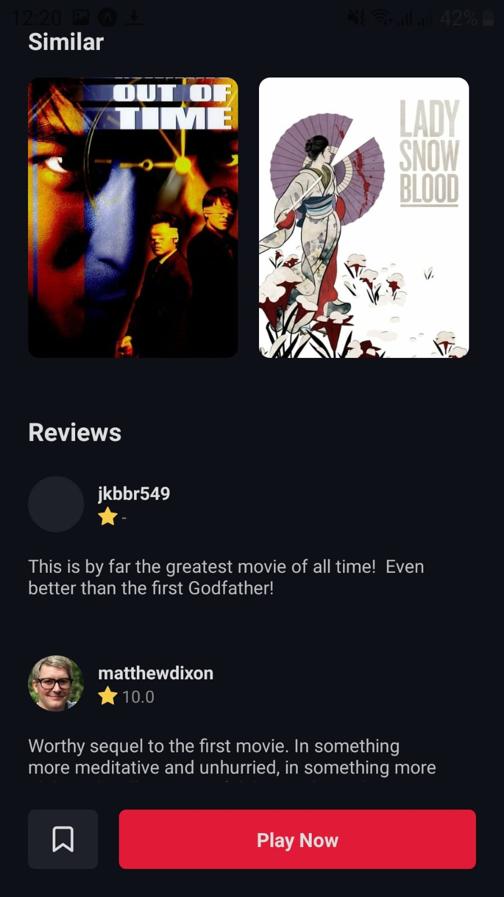

## Installation

1. Clone the repository: `git clone https://github.com/your-username/MovieLand.git`
2. Install dependencies: `npm install`
3. Run the app: `npm start` or `expo start`

## Technologies Used

- React Native
- Fetch API
- vidsrc
- Expo
- Themoviedb API
- AsyncStorage

## Contributing

We welcome contributions from the community! If you have any feature suggestions, bug reports, or other contributions, please submit a pull request or open an issue.

## License

This project is licensed under the [MIT License](LICENSE).

---

Join the MovieLand community and embark on a cinematic adventure like no other. Immerse yourself in the world of movies, indulge in unforgettable stories, and let MovieLand be your gateway to a captivating film experience. Lights, camera, action! 🌟🎥✨
